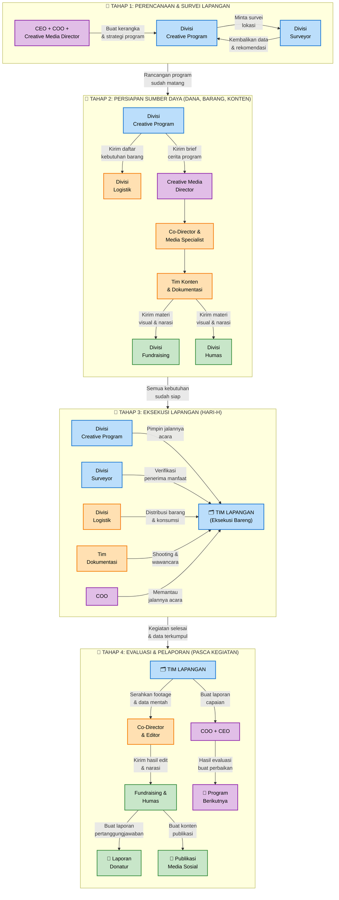

# Alur Kerja Program Kegiatan

Diagram berikut menggambarkan alur kerja lintas divisi dalam menjalankan sebuah program kegiatan, mulai dari perencanaan awal hingga evaluasi pasca kegiatan.

---

### 📝 _PENJELASAN SINGKAT SETIAP TAHAP:_

| Tahap | Nama | Inti Kerjasama |
| --- | --- | --- |
| **1** | Perencanaan & Survei | CEO/COO/Creative Media Director bikin kerangka ➡️ Creative Program bikin rancangan detail ➡️ Surveyor turun lapangan cek lokasi ➡️ hasil survei dipakai buat revisi rancangan. |
| **2** | Persiapan Sumber Daya | Creative Program kirim kebutuhan ke Logistik (barang) & ke Creative Media Director (brief) ➡️ Co-Director/Media Specialist atur produksi konten ➡️ Tim Konten/Dokumentasi bikin materi ➡️ materi dikasih ke Fundraising (buat galang dana) & Humas (buat jalin mitra). |
| **3** | Eksekusi Lapangan | Semua tim inti (Program, Surveyor, Logistik, Dokumentasi) bergerak bareng di lapangan, dipimpin Program Lead, dimonitor COO. |
| **4** | Evaluasi & Pelaporan | Tim Lapangan bikin laporan ke CEO/COO ➡️ Tim Lapangan juga serahin footage ke Co-Director/Editor ➡️ hasil edit + narasi dikasih ke Fundraising & Humas ➡️ mereka bikin laporan donatur & publikasi medsos ➡️ CEO/COO pakai evaluasi buat program berikutnya. |
